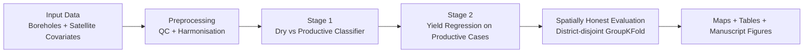
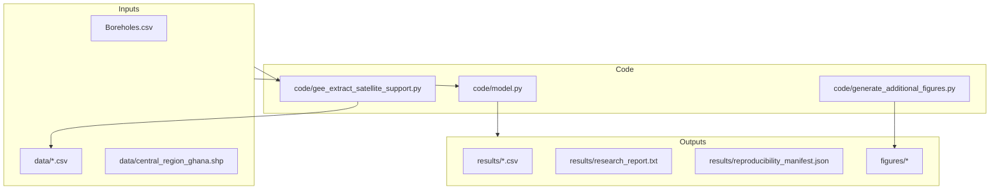

# Central Region Ghana Groundwater Benchmark

Publication-ready benchmark workflow for borehole yield prediction in crystalline basement aquifers (Central Region, Ghana).

## Why this repository exists

This package is designed to be:
1. Reproducible: code, metadata, manifests, and reports are bundled.2
2. Spatially honest: district-disjoint validation is used to reduce leakage.
3. Publication-oriented: manuscript, figures, and model outputs are provided in one place.

## Repository map

| Folder | Purpose |
|---|---|
| `code/` | Core modelling and figure-generation scripts |
| `data/` | Study-area boundary and lightweight supporting datasets |
| `results/` | Predictions, fold and district metrics, manifests, and reports |
| `figures/` | Exported figures used in manuscript and package |
| `models/` | Saved trained artefacts |
| `manuscript/` | LaTeX manuscript source (Elsevier format) |
| `docs/` | Reproducibility notes and metadata |

## Workflow at a glance



## Data and modelling flow



## Headline benchmark results

### Primary baseline

The primary baseline is reported with the following metrics:
- Stage 1: Accuracy, F1.
- Stage 2: R2, RMSE, MAE, Spearman rho, zone accuracy, direction accuracy, and bias (m3/h).

This gives a balanced view of classification quality, regression error, rank consistency, directional reliability, and systematic over- or under-prediction.

### SSL sensitivity run

The SSL sensitivity analysis is evaluated with the same Stage 2 metric suite:
- R2, RMSE, MAE, Spearman rho, zone accuracy, direction accuracy, and bias (m3/h).

Using the same metric family allows a direct, like-for-like comparison between the baseline and SSL-enhanced variants.

## Groundwater potential classes

| Score range | Interpretation |
|---|---|
| 0.0-0.5 | Very low |
| 0.5-1.5 | Moderate |
| 1.5-2.0 | High |
| 2.0-2.5+ | Very high |

## Quick start

Run baseline profile:

```bash
python code/model.py --profile optimized --boreholes-file Boreholes.csv
```

Run tuned SSL sensitivity profile:

```bash
python code/model.py --profile optimized_ssl --boreholes-file Boreholes.csv --ssl-latent-dim 4 --ssl-hidden-dim 16 --ssl-epochs 120 --ssl-mask-prob 0.10 --ssl-lr 0.001
```

## Reproducibility pointers

- See `docs/PUBLICATION_REPRODUCIBILITY.md` for run and packaging details.
- See `docs/model_metadata.json` for model metadata.
- See `results/reproducibility_manifest.json` for exact output tracking.
- See `results/research_report.txt` for narrative summary of the latest run.

## Important data-availability notes

- `Boreholes.csv` contains sensitive/raw borehole records and is intentionally excluded from version control in this snapshot.
- `SMAP_SOIL_MOISTURE.csv` and `MODIS_LAND_COVER_GHANA.csv` are omitted due to size constraints in Git-based distribution.
- The repository keeps a lightweight dissemination package; bulky local files remain outside tracked contents.
